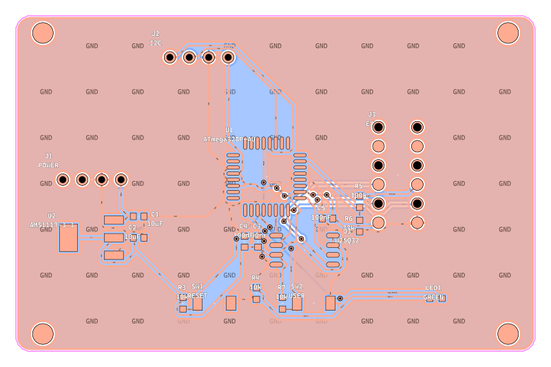
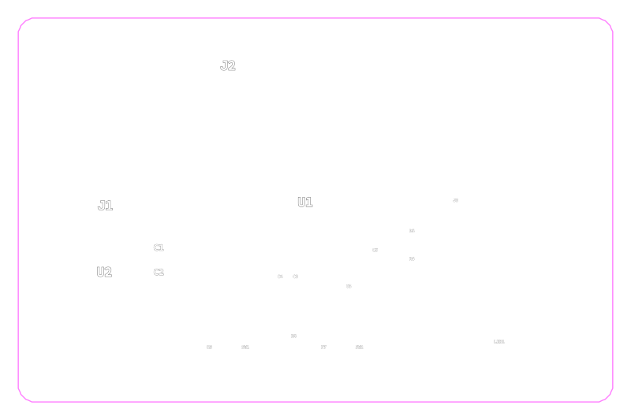
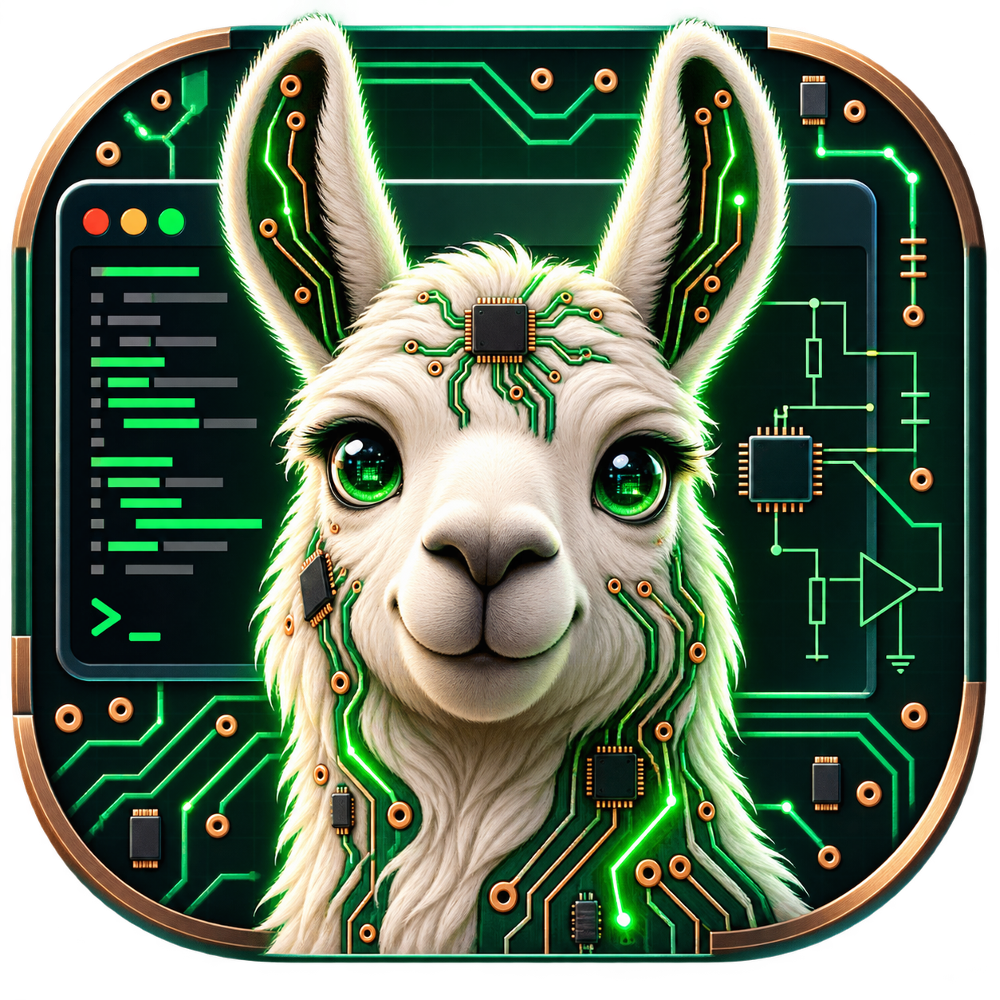

# PCB Designer

Status: Active PCB automation project / local AI workflow prototype

I am building this PCB design assistant to connect AI agents to EasyEDA Pro through MCP tools. I started from the open-source EasyEDA Copilot project and rebuilt it into a more complete hardware-design workflow focused on project setup, part selection, schematic edits, PCB layout, routing checks, DRC feedback, manufacturing-readiness outputs, and local Ollama model testing.

## Overview

PCB Designer is my experiment in using AI as a practical electronics design assistant instead of only a chat interface. My goal is to let an agent inspect the current EasyEDA project, choose parts, create or update a schematic, move into PCB layout, route the board, run design checks, inspect logs, and report exactly what succeeded or failed.

I built the workflow around EasyEDA Pro Desktop, a customized EasyEDA Copilot extension, an MCP server, and a local bridge that can connect the same tool workflow to Codex-style agents or Ollama models. I keep this public repository as a showcase and documentation page while the active source code stays separate during rapid development.

## System Architecture

- EasyEDA Pro Desktop is the live schematic and PCB editor.
- A customized EasyEDA extension exposes design, project, schematic, PCB, DRC, simulation, and manufacturing actions.
- MCP tools give an AI harness structured access to EasyEDA instead of relying on screen scraping.
- A bridge layer lets local Ollama models call the same tools for low-cost experiments.
- Launcher scripts start the correct local model, context window, EasyEDA MCP profile, and working directory.
- Smoke tests verify tool schemas, compact outputs, active-tab inference, DRC behavior, and common board-building workflows.

## What Changed From EasyEDA Copilot

I began with code from the EasyEDA Copilot GitHub repository. Since then, I have reshaped the fork around MCP-native PCB automation and local-agent workflows.

Major changes include:

- Added broader MCP tools for project creation, document opening, project inspection, schematic cleanup, part resolution, schematic changes, PCB layout, routing, DRC, simulation readiness, and manufacturing output preparation.
- Added compact tool outputs so smaller local models spend less context on repeated EasyEDA data.
- Added workflow guidance and tool inventories designed for LLMs, including board-build checklists and model-friendly tool descriptions.
- Added active-tab inference so tools can often infer the linked schematic or PCB document from the current EasyEDA tab.
- Added repair and audit tools for common generated-PCB issues, including duplicate mechanical holes, value/silkscreen problems, ratline recalculation, and copper pour checks.
- Added local Ollama launcher support with model, context, profile, thinking, chat save/load, and smoke-test commands.
- Added release-gate and smoke-test scripts for bridge parity, installed tool schemas, compact-output budgets, updater behavior, EasyEDA logs, live MCP calls, and manufacturing visual QA.
- Added desktop shortcut support for launching a local Ollama MCP workflow more quickly.

## PCB Workflow

The intended workflow is:

1. Connect to an open EasyEDA Pro instance.
2. Read the active project and document state.
3. Create or open a board project.
4. Resolve verified parts.
5. Apply schematic changes.
6. Validate the schematic.
7. Check simulation readiness or run local simulation when models are available.
8. Configure current-sensitive board rules when needed.
9. Generate or update the PCB layout.
10. Route the board.
11. Run DRC and read back board status.
12. Prepare manufacturing-readiness outputs.
13. Report the exact state of the board, including blockers.

The most important behavior is honesty: I do not want the agent to report success unless the EasyEDA tools prove that the step succeeded.

## Visual Outputs

The tooling can export board previews and manufacturing QA images for review.

## Local Model Work

My local launcher work focuses on testing how far my laptop can push PCB automation with Ollama models. I use smaller models for fast MCP smoke tests, while larger models can be tried for complete board-building runs when latency is acceptable.

## Validation Status

I have tested the current toolchain with static release gates and local bridge smoke tests. The project has also produced board previews and manufacturing QA outputs from EasyEDA data. Local model runs are still being tuned because small models can stall, choose parts slowly, or get confused by large tool catalogs without compact profiles and explicit workflow guidance.

I do not treat this as a fully validated manufactured hardware product yet. It is best described as an active PCB automation prototype with working EasyEDA integration and a growing validation workflow.

## What This Demonstrates

- MCP-based control of a professional PCB editor
- AI-assisted schematic and PCB workflow automation
- Local Ollama model integration with hardware-design tools
- Practical tool-output design for smaller local models
- DRC, routing, manufacturing, and log-readback automation
- Engineering documentation around an evolving hardware/software toolchain

## Future Improvements

- Improve local-model reliability on complete one-prompt PCB builds.
- Add clearer model presets for speed, balanced reasoning, and long-context board work.
- Add more visual examples from successful end-to-end board generation runs.
- Add a cleaned public demo video once the local workflow is stable enough to showcase.
- Continue reducing tool ambiguity so smaller models choose the right high-level workflow tool first.
- Add more measured validation data after boards are fabricated or tested physically.

